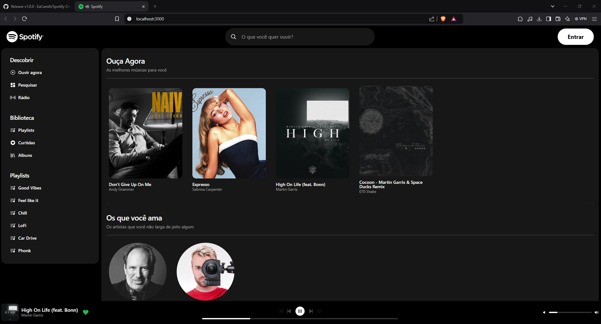

# 🎵 Spotify Clone - Imersão Frontend Alura

Este projeto foi desenvolvido durante a **Imersão Front-End da Alura**, onde o desafio foi recriar a interface da plataforma de streaming de músicas Spotify. No entanto tomei a liberdade de ir um pouco além implementando funcionalidades extras, como **preview de músicas** e **exibição dinâmica de informações**, tudo utilizando as informações diretamente do Spotify.

## 🚀 Tecnologias utilizadas

- **Next.js** - Para renderização eficiente e melhor experiência do usuário  
- **Tailwind CSS** - Para estilização rápida e responsiva  
- **Spotify Web API** - Para obter previews de músicas e informações de álbuns 

## 🎨 Funcionalidades

✅ Recriação da interface do Spotify com um toque de minimalismo  
✅ Preview de músicas diretamente na interface  
✅ Exibição de thumbnails dinâmicas dos álbuns e playlists  
✅ Interface responsiva e interativa
✅ Busca de músicas dinâmica diretamente da API do Spotify
✅ Data Scrapper direto da API do Spotify

## 📸 Exemplos da Aplicação


[<video/>](https://github.com/EaCamih/Spotify-Desafio/blob/main/public/Exemple1.1.0.mp4)

https://github.com/user-attachments/assets/34b29846-0b94-4ac7-9df4-718fc6e3aaaf

## 📦 Como rodar o projeto localmente

1. Clone este repositório:  
   ```sh
   git clone https://github.com/EaCamih/Spotify-Desafio.git
   ```
2. Acesse a pasta do projeto:  
   ```sh
   cd Spotify-Desafio
   ```
3. Instale as dependências:  
   ```sh
   npm install
   ```
   ou
   ```sh
   yarn install
   ```
4. Coloque as credenciais de API:  
   ```json
   SPOTIFY_CLIENT_ID: "CLIENT ID",
   SPOTIFY_CLIENT_SECRET: "CLIENT SECRET"
   ```
5. Inicie o servidor de desenvolvimento:  
   ```sh
   npm run dev
   ```
   ou
   ```sh
   yarn dev
   ```
6. Acesse `http://localhost:3000` no navegador

## 🛠 Melhorias Futuras

🔹 Novas telas com novas informações acessíveis pela barra de navegação

## 📜 Licença

Este projeto está sob a licença MIT. Sinta-se à vontade para contribuir!

---
Desenvolvido pela [Camilla Viana](https://github.com/EaCamih) 💜
